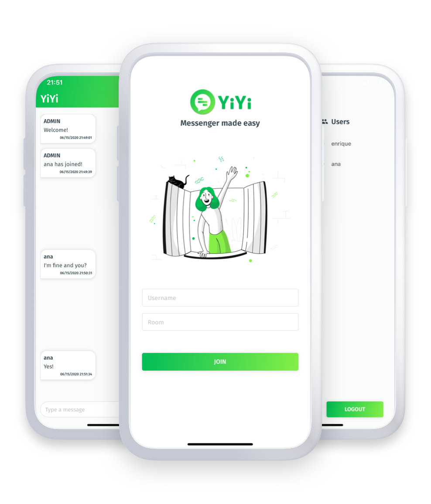

# YiYi (Backend)

YiYi allows you to instantly connect with your friends in rooms through an easy to use messaging service.



## Introduction

This repository contains the Backend development of YiYi, which is a web server built with NestJS.

Follow the instructions below to obtain a copy of the project and run it on your computer for development or evaluation tests.

### Requirements

The project's development environment is configured to be used with *Nest CLI* and *Yarn*. To use a development environment it is necessary to have:

```
* Nest CLI v12.13.0^
* Yarn 7.2.0^^
```

> Additionally, it is necessary to run a Redis Server. There are multiple ways to run Redis. The easiest way to start is to sign-up for the free [Redis Cloud](https://redislabs.com/redis-enterprise-cloud/) service offered by **Redis Labs**. 

## Installation

First, you need to get the project repository. If you have any version of *git*, clone the repo with:

```
$ git clone https://github.com/0xELJ/yiyi-backend.git
```

Once obtained the project repo, must be installed the required dependencies to run the development environment:

```
$ yarn install
```

At the end of the installation, the environment will be ready to be run. Also, it's possible to change the host and port from the HTTP server and Redis Server in the [.env file](.env).

## Execution

To start the local development server with *Nest CLI*, type the following command:

```
$ yarn start
```

This command starts the app with the HTTP server listening on the URL http://localhost:5000/ by default. The server started will connect to a Redis Server using the host *localhost* and port *6379* by default. 

## Tech Stack

* [NestJS](https://nestjs.com/)
* [Redis](https://redis.io/)
* [NestJS Redis](https://www.npmjs.com/package/nestjs-redis)

## Author

* **Enrique López Jiménez**
